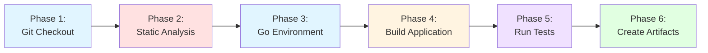
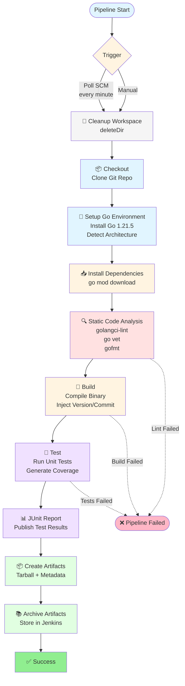

# CI/CD Workshop - Jenkins & Go

Complete workshop materials for learning CI/CD with Jenkins and Go. This workshop uses a phased approach to gradually build a production-ready CI/CD pipeline.

## 📁 Project Structure

```
workshop-cicd/
├── cmd/
│   └── webapp/              # Go web application
│       ├── main.go          # Main application code
│       └── main_test.go     # Unit tests
├── jenkins/
│   ├── Jenkinsfile          # Main pipeline (legacy)
│   └── phases/              # 🎓 Workshop phases (progressive learning)
│       ├── README.md        # Complete workshop guide
│       ├── phase1-basic-checkout.jenkinsfile
│       ├── phase2-add-go-environment.jenkinsfile
│       ├── phase3-add-build.jenkinsfile
│       ├── phase4-add-tests.jenkinsfile
│       ├── phase5-add-static-analysis.jenkinsfile
│       └── phase6-add-artifacts.jenkinsfile
├── docker/                  # Docker setup for Jenkins
│   ├── docker-compose.yml   # Jenkins container orchestration
│   └── Dockerfile.jenkins   # Custom Jenkins image
├── scripts/
│   ├── build.sh             # Local build script
│   └── install-jenkins.sh   # Jenkins installation for Vagrant
├── bin/                     # Compiled binaries (generated)
├── artifacts/               # Build artifacts (generated)
├── go.mod                   # Go module definition
├── .golangci.yml            # Linter configuration
└── Vagrantfile              # VM configuration (Ubuntu 24.04)
```

## � Workshop Pipeline Progression

### High-Level CI/CD Flow (Simplified)



### Complete Technical Pipeline (Phase 6)



## �🚀 Quick Start

### Option 1: Vagrant VM (Recommended for Workshop)

```bash
# Start the VM
vagrant up

# Access Jenkins at http://localhost:8080
# Initial password: 8e6b171e8fd147bf99bdd3507d7bf861
```

### Option 2: Docker

```bash
# Start Jenkins in Docker
cd docker
docker-compose up -d

# Access Jenkins at http://localhost:8081
# Get initial admin password:
docker exec jenkins cat /var/jenkins_home/secrets/initialAdminPassword
```

### 3. Configure Jenkins Pipeline

1. Create new Pipeline job in Jenkins
2. Configure Pipeline script from SCM
3. Set Repository URL: `https://github.com/epam-msdp/CICD-workshop-day1.git`
4. Set Script Path: `jenkins/phases/phase1-basic-checkout.jenkinsfile`
5. Progress through phases 1-6 during the workshop

## 📚 Workshop Guide

👉 **[Complete Workshop Guide](jenkins/phases/README.md)** - Start here!

The workshop is divided into 6 progressive phases:

1. **Phase 1: Basic Git Checkout** - Connect Git repository to Jenkins
2. **Phase 2: Go Environment + Triggers** - Set up Go and automated builds
3. **Phase 3: Build + Cleanup** - Compile application with version injection
4. **Phase 4: Tests** - Run unit tests with JUnit reporting
5. **Phase 5: Static Analysis** - Add code quality checks
6. **Phase 6: Artifacts** - Create and archive build artifacts (production-ready)

## 🔧 Key Components

### Go Web Application
- Simple HTTP server on port 8090
- RESTful endpoints: `/`, `/health`, `/version`
- Security: HTTP timeouts configured (ReadTimeout, WriteTimeout, IdleTimeout)
- Unit tests with 41.2% coverage
- Version injection via build flags

### Progressive Jenkins Pipeline (6 Phases)
- **Phase 1**: Basic Git checkout
- **Phase 2**: Automated triggers (pollSCM every minute)
- **Phase 3**: Workspace cleanup + Go build
- **Phase 4**: Unit tests with JUnit reporting
- **Phase 5**: Static code analysis (golangci-lint, go vet, gofmt)
- **Phase 6**: Create and archive artifacts (complete CI/CD)

### Infrastructure Options
- **Docker**: Jenkins in container (port 8081)
- **Vagrant**: Ubuntu 24.04 LTS VM (port 8080)
- Automated Go 1.21.5 installation
- Architecture detection (amd64/arm64)

## 📝 Prerequisites

- [Vagrant](https://www.vagrantup.com/downloads) installed
- [VirtualBox](https://www.virtualbox.org/wiki/Downloads) installed
- At least 4GB of free RAM
- Go 1.21+ (for local development)

## 🎯 Learning Objectives

By completing this workshop, you will learn:

1. ✅ **Git Integration** - Connect Git repositories to Jenkins
2. ✅ **Automated Triggers** - Configure SCM polling and webhooks
3. ✅ **Environment Setup** - Automated Go installation and configuration
4. ✅ **Build Pipeline** - Compile Go applications with version injection
5. ✅ **Testing** - Unit tests with coverage and JUnit reporting
6. ✅ **Code Quality** - Static analysis with golangci-lint
7. ✅ **Artifacts** - Package and archive build outputs
8. ✅ **Progressive Learning** - Build pipeline incrementally phase by phase

## 🧪 Application Endpoints

Once running, the application provides:

- `GET /` - Web UI with application info
- `GET /health` - Health check (JSON)
- `GET /version` - Version information (JSON)

## 🛠️ Development Commands

```bash
# Build the application
./scripts/build.sh

# Run tests
go test -v ./...

# Run with coverage
go test -v -cover ./...

# Run the application
./bin/app

# Clean build artifacts
rm -rf bin artifacts
```

## 📦 Complete Pipeline Stages (Phase 6)

1. **Cleanup Workspace** - Clean working directory (deleteDir)
2. **Checkout** - Clone Git repository
3. **Setup Go Environment** - Install Go 1.21.5 (auto-detect architecture)
4. **Install Dependencies** - Download Go modules (go mod download)
5. **Static Code Analysis** - golangci-lint, go vet, gofmt checks
6. **Build** - Compile with version/commit/time injection
7. **Test** - Run unit tests with JUnit XML reports
8. **Create Artifacts** - Build tarball with binary, coverage, metadata
9. **Archive Artifacts** - Store in Jenkins for download

## 🐛 Troubleshooting

### Docker Jenkins Issues
```bash
# Check logs
docker-compose logs -f

# Restart Jenkins
docker-compose restart

# Get admin password
docker exec jenkins cat /var/jenkins_home/secrets/initialAdminPassword
```

### Vagrant Jenkins Issues
```bash
vagrant ssh
sudo systemctl status jenkins
sudo systemctl restart jenkins
```

### Pipeline Fails on Go Installation
The pipeline automatically detects architecture (amd64/arm64) and installs Go 1.21.5. Check logs for:
- Architecture detection output
- Download URL
- File permissions

### Test Reports Not Showing
Ensure JUnit plugin is installed in Jenkins:
- Manage Jenkins → Plugins → Available → Search "JUnit"

### Static Analysis Fails
golangci-lint installs automatically. If issues persist:
```bash
# Check GOPATH/bin directory creation
mkdir -p ${GOPATH}/bin
```

## 🧹 Cleanup

### Docker
```bash
# Stop Jenkins
docker-compose down

# Remove volumes (deletes all Jenkins data)
docker-compose down -v
```

### Vagrant
```bash
# Stop the VM
vagrant halt

# Destroy the VM
vagrant destroy
```

### Local Files
```bash
# Clean build artifacts
rm -rf bin/ artifacts/

# Clean Go cache
go clean -cache -testcache
```

## 📖 Additional Resources

- [Jenkins Documentation](https://www.jenkins.io/doc/)
- [Go Documentation](https://go.dev/doc/)
- [Vagrant Documentation](https://www.vagrantup.com/docs)

## ✅ Workshop Features

- ✅ **6 Progressive Phases** - Learn incrementally
- ✅ **Docker & Vagrant** - Choose your infrastructure
- ✅ **Automated Go Setup** - No manual installation needed
- ✅ **Real Go Application** - HTTP server with tests
- ✅ **Complete CI/CD** - From checkout to artifacts
- ✅ **Code Quality** - Static analysis integrated
- ✅ **Test Reporting** - JUnit XML with Jenkins UI
- ✅ **Architecture Support** - AMD64 and ARM64
- ✅ **Production Ready** - All phases tested and working

## 🔗 Repository

**GitHub**: [epam-msdp/CICD-workshop-day1](https://github.com/epam-msdp/CICD-workshop-day1)

---

**Ready to start?** 👉 Check out the **[Workshop Guide](jenkins/phases/README.md)**!
